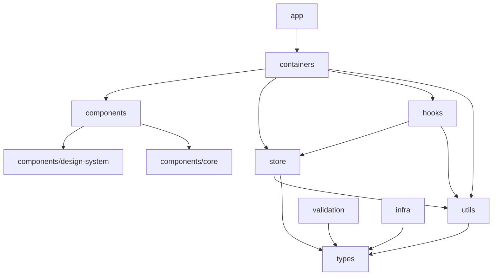

# FlumeTV UI — frontend reference

**Last updated:** 2026-05-30

Authoritative context for the **FlumeTV-UI** repository: what the Next.js app does, how modules fit together, and how it integrates with **FlumeTV-API**. For quick start and scripts, see [README.md](../README.md). Server architecture and SSE wire formats: sibling [FlumeTV-API/docs/backend-reference.md](../../FlumeTV-API/docs/backend-reference.md). Full REST `code` catalog: [api-error-codes.md](../../FlumeTV-API/docs/api-error-codes.md).

**API conventions:** REST routes are under **`/api`**. Errors are `{ code, message }` — branch on **`code`** (from `FlumeTV-API/src/constants/errorCodes.constants.ts`), not by parsing **`message`**.

---

## Overview

FlumeTV-UI is a **Next.js 16** (App Router) management panel for the FlumeTV Stremio IPTV addon. Users register or log in, link **Direct M3U** or **Xtream** sources, monitor prefetch/sync status, and copy Stremio install links.

| Concern         | Implementation                                                                                                  |
| --------------- | --------------------------------------------------------------------------------------------------------------- |
| **Runtime**     | React 19, MUI 7 + Emotion, Redux Toolkit, axios, react-hook-form + Zod, react-i18next                           |
| **Package**     | `flumetv-ui` (npm), repo [FlumeTV-UI](https://github.com/TonyCJ7/FlumeTV-UI)                                    |
| **API sibling** | `../FlumeTV-API` — session cookie auth, CORS with `credentials: 'include'`                                      |
| **Theme**       | Slate palette + light/dark — `theme/tokens.ts`, `theme/createAppTheme.ts`                                       |
| **Port**        | Dev UI **7000** (`next dev`); production **`PORT`** env (default **7000**, `server.js`); API typically **7001** |

**Initial greenfield implementation** completed **2026-04** through **2026-05**. Agents keep this file aligned with shipped functionality per [`.cursor/rules/frontend-reference-maintenance.mdc`](../.cursor/rules/frontend-reference-maintenance.mdc). Workflow, rule priority, and verify steps: [AGENTS.md](../AGENTS.md) and [`.cursor/rules/design-principles.mdc`](../.cursor/rules/design-principles.mdc) (YAGNI → DRY → SOLID).

---

## Architecture

### Layering (import direction)



| Folder                          | Role                                                    | Must not contain           |
| ------------------------------- | ------------------------------------------------------- | -------------------------- |
| **`app/`**                      | Routes, root layout, metadata, error boundaries         | Business logic, API calls  |
| **`containers/`**               | Screens: `useTranslation`, dispatch, compose children   | Shared DTOs (use `types/`) |
| **`components/design-system/`** | Domain-neutral primitives (Button, DialogShell, fields) | Product copy, API types    |
| **`components/core/`**          | Product widgets (config cards, log viewer, badges)      | Redux                      |
| **`components/layout/`**        | App shell, donate, page chrome                          | —                          |
| **`components/providers/`**     | Redux, i18n, theme, session bootstrap                   | —                          |
| **`store/`**                    | Slices, thunks, selectors                               | Reusable DTO shapes        |
| **`types/`**                    | `*.types.ts` only                                       | `const`, Zod, functions    |
| **`constants/`**                | Runtime consts                                          | Types                      |
| **`validation/`**               | Zod + inferred form types                               | API DTOs                   |
| **`utils/`**                    | Pure helpers, error mappers                             | Exported types             |
| **`infra/`**                    | axios client, env, i18n instance, color mode            | Duplicated `types/`        |
| **`hooks/`**                    | SSE hooks, layout, merged rows                          | —                          |
| **`translations/`**             | Locale JSON                                             | Logic                      |

Strict boundaries: [`.cursor/rules/module-folder-boundaries.mdc`](../.cursor/rules/module-folder-boundaries.mdc). Extraction and abstractions: [`.cursor/rules/design-principles.mdc`](../.cursor/rules/design-principles.mdc).

### Provider tree (`app/layout.tsx`)

Order (outer → inner): **`ThemeProviders`** (MUI cache, `CssBaseline`, color-mode bootstrap script) → **`I18nProvider`** → **`ReduxProvider`** → **`ColorModeProvider`** → **`SessionBootstrapProvider`** → **`AuthShellProvider`** → children.

**Color mode:** `infra/colorMode/` — key `flumetv-color-mode` (`COLOR_MODE_STORAGE_KEY`). Inline bootstrap script on `<body>` avoids flash; manual toggle persists and stops following OS until cleared.

---

## Routes and information architecture

| Route          | Container / behavior                                                                                      |
| -------------- | --------------------------------------------------------------------------------------------------------- |
| **`/`**        | `app/page.tsx` — skeleton until `sessionReady`, then `replace` → `/config` (authed) or `/install` (guest) |
| **`/install`** | `InstallPageContainer` — account ID, change password, Stremio copy/install                                |
| **`/config`**  | `ConfigPageContainer` — source list, dialogs, hash ops, prefetch SSE                                      |
| **Auth**       | Modal only (`AuthDialogContainer`) — not a route                                                          |

**Post-auth navigation (default):**

- **Register** → `/config`
- **Login** → `/install`
- **Logout** → confirmation dialog → `/install` + auth dialog

**Stremio configure redirect** (`GET /:token/configure` → `{FRONTEND_ORIGIN}/config?uuid={userId}`): handled by `useConfigureRedirectAuth` — login-only tab, prefilled locked account ID, logout when session user ≠ `uuid`, strip query when matched, stay on `/config` after login (override default login → `/install`).

Shell: `app/(main)/layout.tsx` wraps **`AppLayout`** (primary nav, theme toggle, donate, responsive drawer).

---

## Redux state

| Slice                | Module                  | Responsibility                                                                                 |
| -------------------- | ----------------------- | ---------------------------------------------------------------------------------------------- |
| **`auth`**           | `store/auth/`           | `userId`, `sessionReady`, auth dialog mode/open, configure-login hint, register-success dialog |
| **`configs`**        | `store/configs/`        | List from `GET /api/configs`, CRUD/hash thunks, per-hash `mutating`, list status/error         |
| **`prefetchStatus`** | `store/prefetchStatus/` | `byHash`, `globalQueue` (stored, **no UI**), one-shot fetch status                             |
| **`ui`**             | `store/ui/`             | Dialog open state, log line buffer (`upsertLogLine` by `logKey`)                               |
| **`install`**        | `store/install/`        | Manifest URL fetch for Stremio buttons                                                         |

**Merged list rows:** `selectMergedConfigRows` (`prefetchStatusSelectors.ts`) joins `configs.items` with `prefetchStatus.byHash` via `derivePrefetchUiBand` (`utils/prefetchUiBand.utils.ts`). `useStableMergedConfigRows` debounces band flips (`PREFETCH_BAND_DEBOUNCE_MS`).

---

## API integration (wired)

All calls use `infra/apiClient.ts` (axios, `withCredentials: true`, `RestApiError` on `{ code, message }`, session expiry → `expireSession`).

| Method   | Path                                  | Thunk / hook              | UI surface                     |
| -------- | ------------------------------------- | ------------------------- | ------------------------------ |
| `POST`   | `/api/auth/register`                  | `registerUser`            | Auth dialog                    |
| `POST`   | `/api/auth/login`                     | `loginUser`               | Auth dialog                    |
| `POST`   | `/api/auth/logout`                    | `logoutUser`              | Shell log out (confirm dialog) |
| `GET`    | `/api/auth/me`                        | `bootstrapSession`        | App load (once)                |
| `POST`   | `/api/auth/change-password`           | `changePassword`          | Install page                   |
| `GET`    | `/api/stremio/manifest-url`           | `fetchManifestUrls`       | Install page                   |
| `GET`    | `/api/configs`                        | `fetchConfigsList`        | Config page list               |
| `POST`   | `/api/configs`                        | `addConfig`               | Add config dialog              |
| `PUT`    | `/api/configs/:hash`                  | `updateConfig`            | Edit config dialog             |
| `DELETE` | `/api/configs/:hash`                  | `deleteConfig`            | Confirm + card                 |
| `GET`    | `/api/configs/prefetch-status`        | `fetchPrefetchStatus`     | After mutations (one-shot)     |
| `GET`    | `/api/configs/prefetch-status/stream` | `usePrefetchStatusStream` | Config page (list non-empty)   |
| `GET`    | `/api/hashes/:hash/logs/stream`       | `useConfigLogStream`      | Log dialog open                |
| `POST`   | `/api/hashes/:hash/refetch`           | `refetchConfigHash`       | Card CTA                       |
| `POST`   | `/api/hashes/:hash/cancel`            | `cancelConfigHash`        | Card CTA                       |
| `PATCH`  | `/api/hashes/:hash/active`            | `patchConfigHashActive`   | Card switch                    |

Types mirror `FlumeTV-API/src/types/rest.types.ts` and `room.types.ts` under `types/`. Zod + mappers under `validation/` and `utils/config.utils.ts`.

### Server wiring (client expectations)

| Concern             | Behavior                                                                                                                                                               |
| ------------------- | ---------------------------------------------------------------------------------------------------------------------------------------------------------------------- |
| **CORS**            | API allows `FRONTEND_ORIGIN` (default `http://localhost:7000`) with **`credentials: true`** — axios uses **`withCredentials: true`**.                                  |
| **Session**         | httpOnly cookie (default name **`session`**). **`GET /api/auth/me`** returns **`{ userId }`** on boot. **`POST /api/auth/logout`** clears cookie (idempotent **200**). |
| **Body limits**     | `/api/auth/*`: **32kb** JSON. Other `/api/*`: **50mb** (large playlist payloads).                                                                                      |
| **Auth rate limit** | **`/api/auth`** only — default **60** / **15m**. UI shows generic “try again” on **HTTP 429** (no stable `code` in body).                                              |

**Stremio addon** routes (`/:token/catalog`, `/stream`, …) are for the Stremio client. The UI only uses REST above plus **`GET /:token/configure`** → **`/config?uuid={userId}`**.

### DTO highlights

Authoritative shapes: `FlumeTV-API/src/types/rest.types.ts`, `room.types.ts` → mirrored in `types/`.

**`RoomSyncProgress`** (JSON field **`progress`**, not `syncPercent`):

```typescript
{
  percent: number;       // 0–100, monotonic within one room run
  phase?: string;        // e.g. auth | live | vod | series | m3u | db
  bytesRead?: number;
  bytesTotal?: number | null;  // null when Content-Length unknown
}
```

**List row:** **`configName`** (per-user title — never derive from URL/hash), `hash`, `type`, `isActive`, `roomStatus`, **`roomLastOutcome`** (persisted result of the most recent finished run), **`progress`**, `lastSyncedAt`, `triggeredBy`, `triggeredByMe`, scheduler, stable **`roomId`**.

**Prefetch merge:** Prefer **`prefetchStatus.byHash[hash]`** over list fields for band/progress. Steady state after sync: **`room.status: "idle"`**, **`progress: null`** (not `room: null`).

### PUT `/api/configs/:hash` branches

| Response                                                           | UI behavior                            |
| ------------------------------------------------------------------ | -------------------------------------- |
| **`unchanged: true`**                                              | Toast “no changes”; skip list churn    |
| **`configNameUpdated: true`**                                      | Update card title only; no new enqueue |
| Hash transition (`oldHashUnlinked`, new `hash`, `syncEnqueued`, …) | Re-key list; refresh prefetch one-shot |

Implemented in `utils/config.utils.ts` (`classifyPutConfigResponse`) and `utils/editConfig.utils.ts`.

### Error codes → UI (shipped mappers)

| `code`                            | HTTP | UI action                              |
| --------------------------------- | ---- | -------------------------------------- |
| `AUTH_SESSION_MISSING`            | 401  | Auth dialog                            |
| `AUTH_SESSION_INVALID`            | 403  | Clear session; re-login                |
| `AUTH_INVALID_CREDENTIALS`        | 401  | Login fields; stale **`/me`**          |
| `AUTH_BODY_INVALID`               | 400  | Login/register fields                  |
| `REGISTER_PASSWORD_INVALID`       | 400  | Password rules                         |
| `CHANGE_PASSWORD_BODY_INVALID`    | 400  | Change-password fields                 |
| `CHANGE_PASSWORD_CURRENT_INVALID` | 401  | Current password field                 |
| `CONFIG_BODY_INVALID`             | 400  | Add/edit form                          |
| `CONFIG_ALREADY_EXISTS`           | 409  | Add config dialog inline banner        |
| `QUEUE_BACKLOG_EXCEEDED`          | 429  | Refetch toast (distinct from auth 429) |
| `HASH_SYNC_ALREADY_ACTIVE`        | 409  | Delete/edit while sync active          |
| `HASH_NOT_LINKED_TO_USER`         | 403  | Hash op / stream                       |
| `HASH_CANCEL_NOT_AUTHORIZED`      | 403  | Cancel CTA                             |
| `HASH_NO_ACTIVE_SYNC_TO_CANCEL`   | 409  | Cancel CTA                             |
| `REGISTER_USER_ID_CONFLICT`       | 409  | Register rare retry                    |

Client-only: `REQUEST_TIMEOUT`, `NETWORK_UNREACHABLE`, `UNKNOWN` in `constants/restError.constants.ts`. Unmapped server codes may show **`message`** as-is.

### Loading, empty, and success

| Surface          | Empty          | Loading                                                                    | Success                            |
| ---------------- | -------------- | -------------------------------------------------------------------------- | ---------------------------------- |
| **Config list**  | CTA add source | Skeleton + list **`aria-busy`**; ignore stale response if route left early | Two-row cards from **`configs[]`** |
| **Prefetch SSE** | —              | Background on `/config` when list non-empty                                | Bands update on **`hash`** events  |
| **Install**      | —              | Manifest fetch                                                             | Copy + Stremio Web buttons         |
| **Add/edit**     | Form defaults  | Dialog submit loading                                                      | List refresh + toasts              |
| **Hash ops**     | —              | Per-card busy overlay                                                      | Toast + prefetch one-shot          |

---

## Server-Sent Events

### Prefetch status (primary live updates)

- **URL:** `GET /api/configs/prefetch-status/stream` (`utils/prefetchStatusStream.utils.ts`)
- **Hook:** `usePrefetchStatusStream` — enabled on `/config` when authed and list length > 0
- **Events:** `snapshot` (full body), `hash` (upsert or `entry: null` remove), `global_queue`
- **Per-hash fields:** includes **`hasLogs`** (replayable log buffer on server); merged into cards via `selectMergedConfigRows` → **View logs** CTA
- **Redux:** `applyPrefetchStatusSnapshot`, `upsertPrefetchStatusHashEntry`, `applyPrefetchStatusGlobalQueue`
- **Replaces:** historical 5s poll (removed)

### Log stream (per hash)

- **URL:** `GET /api/hashes/:hash/logs/stream` (`utils/logStream.utils.ts`)
- **Hook:** `useConfigLogStream` — while log dialog open; `withCredentials: true` for cross-origin
- **Events:** `log` (structured `tone`, `logKey`, sector status), `progress` (patches list + prefetch progress), `log_reset` (clear buffer on new run)
- **Resume:** browser `EventSource` native `Last-Event-ID` on reconnect (no custom fetch stream)
- **Buffer:** Redux `ui.logLines`; ring cap `LOG_STREAM_RING_BUFFER_MAX`; same-key merge keeps highest `seq`

### Room events (not wired)

Backend exposes **`GET /api/hashes/:hash/room/events`** (`status`, `progress`, `queue`) per [backend-reference.md](../../FlumeTV-API/docs/backend-reference.md). The UI **does not** open this stream; card state comes from **prefetch-status SSE** + list merge + log `progress` patches.

---

## Prefetch UI bands

`derivePrefetchUiBand` maps merged list + prefetch entry to three bands:

| Band                 | Typical `room.status`                                     | Card CTAs                                                           |
| -------------------- | --------------------------------------------------------- | ------------------------------------------------------------------- |
| **refetchAvailable** | `idle` (steady state after sync — backend idle lifecycle) | Refetch; **View logs** when prefetch entry `hasLogs`                |
| **inQueue**          | `queued`                                                  | Cancel if `triggeredByMe`; **View logs** when `hasLogs`             |
| **inProgress**       | `running`, `fetching`                                     | Cancel if `triggeredByMe`; **View logs** when `hasLogs`; no Refetch |

**View logs:** driven only by **`hasLogs`** on each `ConfigPrefetchStatusEntry` from prefetch-status poll/SSE (`hash` events after sync finish or log buffer wipe on new enqueue). Not inferred from `lastOutcome`. Opens log dialog → `GET /api/hashes/:hash/logs/stream` (replay + live lines; `log_reset` clears buffer).

**Progress display:** use `progress.percent` when present; when band is in progress and `progress` is null, show **Running…** / **Fetching…** from `room.status`, or **Syncing…** as fallback — never invent a percent. When `percent` is present, primary tag shows **`Syncing - N%`** (`ConfigCard.Label_SyncingWithPercent`). Steady **idle** + `progress: null` → ready/refetch band (avoids stuck “Syncing…” after backend Step 32).

**Status tags:** primary pill from prefetch band (`Idle — ready to update`, queue position, in-progress labels above); transient terminal `room.status` values are **not** shown as current status. When `lastOutcome` is set and band is **not** in progress, a second pill shows the outcome label (`Success`, `Failed`, `Error`, `Canceled`) with outcome-matched colors (green / red / amber). **Last-outcome pill is hidden** while refetch/sync is in progress.

**Status popover:** **Current status** row plus queue position, estimated wait, scheduler `nextTriggerAt`, `lastSyncedAt`, **`lastOutcome`**, and when outcome is **`failed`** or **`error`**, optional **`room.closedReason`** detail (prefetch-status SSE only — cleared on new enqueue) — built in `utils/configCardDisplay.utils.ts` via `selectMergedConfigRows`.

---

## Product surfaces (shipped behavior)

### Auth modal

- Segmented **Log in** (default, left) / **Create account**
- No header close on cold session; close after success or explicit logout
- Password fields: `FieldPassword` with in-field reveal
- Register success: `RegisterSuccessDialogContainer` (save user ID)

### Install page

- Disabled chrome when guest (auth modal covers entry)
- Change password: three fields, client rules then `POST /api/auth/change-password`
- Stremio: copy manifest + open Stremio Web (`manifestUrl`, `stremioWebInstallUrl`) — buttons only, no raw URL display

### Config page

- Two-row **ConfigSourceCard**: title (`configName`), type badge, active switch; status tag + prefetch CTAs + edit/delete
- 2-column grid from **720px**; list skeleton + `aria-busy` on load
- Per-card busy overlay + `inert` during hash mutations
- Dialogs: add (Direct/Xtream, EPG disclosure), edit (Xtream password always re-sent), confirm (delete/cancel), log (SSE)
- Add Direct: **Enable EPG** default **off**; Xtream: default **on**

### Shell

- Primary nav: Account/install vs Configs (`PrimaryNavTabs` + icons)
- Theme toggle (sun/moon morph), **donate dialog** — shell donate buttons open a dialog with a Ko-fi link (`constants/brand.constants.ts` → `DONATE_KOFI_URL`; GitHub Sponsors commented out until program approval)
- Breakpoints: MUI **`md` = 970px**; shell hamburger **&lt; 600px**; bottom duplicate donate on narrow viewports

### Brand assets

`constants/brand.constants.ts` → `public/assets/flumeMix.png`, `flume.png`, `donate-coffee.png`, `kofi-logomark.png` (`github-sponsors.svg` kept for when GitHub Sponsors is re-enabled).

---

## Internationalization

- **Runtime:** `infra/i18n/instance.ts`, `translations/en/common.json`, `defaultNS` = `common`
- **Usage:** `useTranslation()` / `<Trans>` in **containers** only
- **Errors:** mappers in `utils/*Error.utils.ts` take `t` and return `t('Section.Key')` literals for known codes; server `message` may pass through for unmapped codes
- **Metadata:** `app/layout.tsx` `generateMetadata` stays **English** until locale routing exists

---

## Environment variables

| Variable       | Required             | Used by                                                 |
| -------------- | -------------------- | ------------------------------------------------------- |
| `PORT`         | No                   | `server.js` — production listen port (default **7000**) |
| `BASE_API_URL` | Yes for API features | `infra/env.ts` → `getBaseApiUrl()` → axios + SSE URLs   |
| `DEBUG_MODE`   | No                   | **Not wired** — reserved in `.env.example`              |

**Local dev:** copy `.env.example` → `.env.local`. **`PORT`** applies to Docker / `npm start` only; `npm run dev` uses port **7000** via the script.

**Docker — two images:**

| Tag                                          | Dockerfile                                                    | Size    | Runtime env                                                                                  |
| -------------------------------------------- | ------------------------------------------------------------- | ------- | -------------------------------------------------------------------------------------------- |
| **`latest`**, **`1.0.0`**                    | `Dockerfile` — multi-stage standalone, pre-built              | ~190 MB | **`PORT`** only; **`BASE_API_URL`** fixed at **`http://localhost:7001`**                     |
| **`configurable`**, **`1.0.0-configurable`** | `Dockerfile.configurable` — single-stage, full `node_modules` | ~1.1 GB | **`PORT`**, **`BASE_API_URL`** via `.env` + container restart (in-container `npm run build`) |

Version pins match **`package.json`** `version`. Floating tags (`latest`, `configurable`) track the newest build of each variant.

Set **`FRONTEND_ORIGIN`** on FlumeTV-API to the browser URL of this UI (CORS + session cookies).

**Production (non-Docker):** run `npm run build` with `BASE_API_URL` set in the environment, then `npm start`.

---

## Not wired / future work

Cross-check against [FlumeTV-API backend reference](../../FlumeTV-API/docs/backend-reference.md). Items below exist on the **API** but are **not** implemented in the React app (or only partially).

| Item                                | Backend / spec                                | Frontend state                                                                                           |
| ----------------------------------- | --------------------------------------------- | -------------------------------------------------------------------------------------------------------- |
| **Per-hash room SSE**               | `GET /api/hashes/:hash/room/events`           | **Not consumed** — prefetch-status stream + log `progress` suffice for v1                                |
| **Global queue UI**                 | `globalQueue` on prefetch-status snapshot/SSE | Stored in **`prefetchStatus.globalQueue`**; **no** shell strip or banner                                 |
| **`DEBUG_MODE`**                    | Mentioned in `.env.example`                   | No runtime reads                                                                                         |
| **Locale routes**                   | Future `translations/<lng>/`                  | **English only**; no `app/[locale]/`                                                                     |
| **Localized metadata**              | —                                             | `generateMetadata` English-only                                                                          |
| **“Follow system” theme**           | Optional product note                         | Manual toggle **locks** stored mode; OS `prefers-color-scheme` only before first manual choice           |
| **Full server `code` → i18n table** | All codes in `api-error-codes.md`             | Subset in `constants/restError.constants.ts` + per-flow mappers; unknown codes may show server `message` |
| **Stremio addon HTTP**              | `/:token/catalog`, `/stream`, etc.            | **Out of scope** — addon client only; UI uses REST + configure redirect                                  |
| **Interval prefetch poll**          | Poll fallback exists on API                   | **Removed** — SSE primary; one-shot GET after mutations only                                             |
| **Guest “try without account”**     | —                                             | **Not product** — auth modal is the only cold entry                                                      |
| **Legacy debug logging on configs** | Not on `POST /api/configs`                    | **Omitted** by design                                                                                    |
| **Multi-palette theme**             | —                                             | **Slate** + light/dark only                                                                              |

When adding a row here, update this table and implement or explicitly defer in product review.

---

## QA and tooling

| Command                       | Purpose                                                     |
| ----------------------------- | ----------------------------------------------------------- |
| `npm run dev`                 | Dev server :7000                                            |
| `npm run build` / `npm start` | Production (`server.js`; `PORT` env)                        |
| `npm run lint`                | ESLint (ignores `temp/`)                                    |
| `npm run format`              | Prettier write (`.prettierrc`, same options as FlumeTV-API) |
| `npm run format:check`        | Prettier check                                              |
| `npm run typecheck`           | `tsc --noEmit`                                              |
| `npm run knip`                | Unused export scan                                          |

---

## Related documentation

| Document                                                                             | Purpose                                              |
| ------------------------------------------------------------------------------------ | ---------------------------------------------------- |
| [README.md](../README.md)                                                            | Quick start, env, scripts                            |
| [FlumeTV-API/docs/backend-reference.md](../../FlumeTV-API/docs/backend-reference.md) | Server architecture, room lifecycle, SSE wire format |
| [FlumeTV-API/docs/api-error-codes.md](../../FlumeTV-API/docs/api-error-codes.md)     | Stable `code` catalog                                |
| [`.cursor/rules/`](../.cursor/rules/)                                                | Code style, boundaries, i18n, responsive rules       |

**Maintenance:** Update when shipped frontend functionality changes — see [`.cursor/rules/frontend-reference-maintenance.mdc`](../.cursor/rules/frontend-reference-maintenance.mdc).
